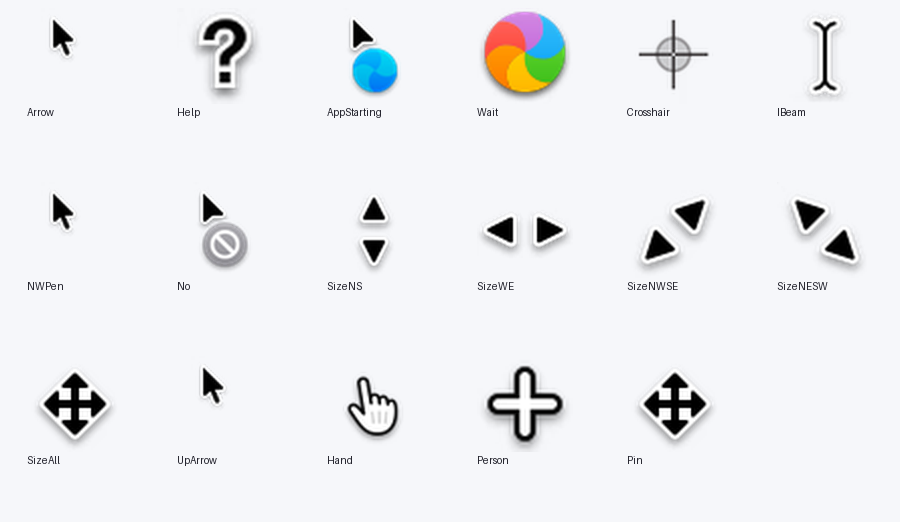
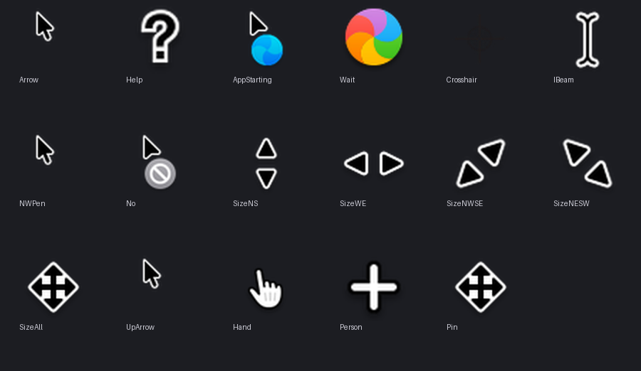

# MacOS 27 Native Square — for Windows 11, all DPI

[](https://github.com/Rickeal-Boss/MacOS27-Native-Square-for-Windows11-allDPI/actions/workflows/verify.yml)

macOS 27 "Golden Gate" 光标，按 Windows 的规则重新打包：**每一个像素都是 Apple 自己的**，
从 `MacOS27-Windows-Cursors` dump 解码而来，没有重绘、没有描边、没有改色。

这个仓库修的是原 dump 在 Windows 上唯一的问题——**它只有一张位图**。
指针尺寸一改、或者 DPI 一高，Windows 就把那一张位图拉大，于是变糊。
这里给每个角色补齐完整的方形页阶梯，让任何 DPI 下都是原生分辨率命中，而不是重采样。





---

## 为什么"all DPI"不能只靠一张图

Windows 选图的方式是：`LookupIconIdFromDirectoryEx` 取**最接近且不超过**请求尺寸的那一张页，
并且**直接用该页自带的热点**。也就是说：

- 阶梯里**有** 48 这一档 → 48 px 原生绘制，热点按 48 网格正确命中；
- 阶梯里**没有** 48 → 拿 32 去放大，热点也一并被缩放，点击点跟着飘。

官方文档的 DPI 阶梯（默认指针尺寸下）是这样：

| 缩放 | 实际 DPI | Windows 请求 | 本包提供 |
|---|---|---|---|
| 100% / 125% | 96 / 120 | 32×32 | ✅ 32 |
| 150% / 175% | 144 / 168 | **48×48** | ✅ 48 |
| 200% / 225% / 250% | 192 / 216 / 240 | **64×64** | ✅ 64 |
| 300% / 350% | 288 / 336 | **96×96** | ✅ 96 |
| 400% 及以上 | ≥ 384 | **128×128** | ✅ 128 |

再加上「设置 → 辅助功能 → 鼠标指针大小」滑块会请求的 24 / 192 / 256，
本包每个静态角色的阶梯是 **24 · 32 · 48 · 64 · 96 · 128 · 192 · 256**，八档全覆盖。

> 175% 这一档是实测中揪出真问题的一档：它请求 48 px，
> 而最初 48 页是从 1x 位图放大的（Help / Person 从 18×18 放大 **2.67×**）。
> 改成从 2x 位图生成后，48 px 档边缘锐度平均 **+30%**（SizeNWSE 最高 +0.25 edge）。

## 方形页：不是审美问题，是正确性

macOS 光标本身不是方的（箭头 28×40，I 形 23×22）。直接搬过来，Windows 会重采样页面
**并且移动热点**——实测一个 24×32 的页声明 (8,16)，加载回来变成 (11,16)。

所以每个页面都补成正方形，图形居中放置（**不拉伸**，比例保持原样），热点按补边偏移平移。
补边后的方形页可以精确往返。

---

## 安装

### 免管理员（推荐）

1. 下载本仓库源码包，解压到任意**持久**位置（不要留在 Downloads / 临时目录 / OneDrive / 未解压的 zip 里）。
2. 进入 `out_native/MacOS27-Native-Square/`，双击 `install_hkcu.cmd`。
   它会把文件复制到 `%LOCALAPPDATA%\Microsoft\Windows\Cursors\MacOS27-Native-Square`，
   导入注册表，并调用 `SPI_SETCURSORS` 让资源管理器立刻重载——**不需要注销**。
3. 若最后一步被安全策略拦下，方案本身仍已注册成功，手动应用即可：
   设置 → 蓝牙和设备 → 鼠标 → 其他鼠标选项 → 指针 → 选择
   `MacOS 27 (Apple Native, square multi-size)` → 应用。

### 全系统安装

右键 `install.inf` → 安装。需要管理员权限，文件落到 `%SystemRoot%\Cursors\MacOS27-Native-Square`。

> `install.inf` 的 `CopyFiles` 按 INF 自身所在目录解析文件名，所以 `.cur` / `.ani`
> 必须与 `install.inf` 同级。`install_hkcu.cmd` 会自动把它们挪到位；手工安装的话请先把
> `cur\` 和 `ani\` 里的文件复制到包根目录。

### 还原

运行 `restore.cmd`，清键并重载，同样不需要注销。

---

## 十七个角色

Windows 11 用十七个指针角色，比大多数光标包填的多两个。这里全部填满：

| | | | |
|---|---|---|---|
| Arrow | Help | AppStarting | Wait |
| Crosshair | IBeam | NWPen | No |
| SizeNS | SizeWE | SizeNWSE | SizeNESW |
| SizeAll | UpArrow | Hand | Person |
| Pin | | | |

- **Person / Pin** 没有 macOS 对应物 → 用 dump `extras/` 里的四向移动箭头。
- **NWPen / UpArrow** 复用箭头，macOS 本身不提供这两种光标。
- **Help** 用 `extras/` 里带框的问号，而不是无框那个：Windows 在「选择帮助主题」时显示它，带框更易读。

---

## 目录结构

```
out_native/MacOS27-Native-Square/   ← 这就是可安装的包
  cur/     15 个静态光标，各 8 页（24…256），32-bit ARGB
  ani/     AppStarting（15 帧）与 Wait（24 帧），Apple 原始节奏，每帧 3 个方形页（32/48/64）
  install_hkcu.cmd / .reg   免管理员安装
  refresh.vbs               通知外壳重载指针
  install.inf               全系统安装
  restore.cmd               还原 Windows 默认
source/
  build_native.py           从 dump 重新生成整个包
  verify_native.py          全量校验
preview/                     32 / 48 / 64 档，浅色与深色背景对照图
```

## 校验

```bash
python source/verify_native.py
```

需要 Python + Pillow。它会检查：`ICONDIR` / `ICONDIRENTRY` / `BITMAPINFOHEADER` 各字段，
页面是否为正方形，阶梯是否完整，AND mask 是否恰为 alpha 的补集，每个热点是否与 Apple 原图一致，
`LoadCursorFromFile` 能否成功加载每个文件，动画是否与 dump 逐帧相同，安装脚本引用的文件是否都存在，
外加一轮光标包常见失效模式的扫描。全部通过会打印 `ALL CHECKS PASSED`。

其中 48 px 档用的是**相对判据**：把每个 48 px 页与「同一页用 2x 源重建」的锐度比对，低于 90% 即失败。
（第一版用的是绝对阈值 0.30，故障注入时抓不到退化——整体变糊但单看仍"达标"。绝对值判据在这里无效。）

需要比对 Apple 原图 dump 的检查（热点保真、动画逐帧、48 px 锐度）在 dump 缺失时会**跳过**而不是崩掉，
所以 CI 没有 dump 也能跑完，结果会注明 `N skipped, no Apple dump`。想跑全量就设置环境变量：

```bash
MACOS27_SRC_1X=/path/to/MacOS27-1x  MACOS27_SRC_2X=/path/to/MacOS27-2x  python source/verify_native.py
```

## 从源码重建

```bash
python source/build_native.py
```

需要先准备 Apple 原始 dump，并修改脚本顶部的两个路径：

```python
SRC_1X = r"...\MacOS27-Windows-Cursors\MacOS27-1x"
SRC_2X = r"...\MacOS27-Windows-Cursors\MacOS27-2x"
```

dump 本身**不在本仓库内**（见下方署名与法律说明）。

---

## 已知边界

- 动画（Wait 沙滩球 / AppStarting 蓝球）的页阶梯只到 64 px。Windows 会把整个 `.ani`
  载入内存，未压缩的 32-bit 页是 `size² × 4` 字节——铺满全部尺寸会让 Wait 变成 12.8 MB，
  而 Windows 自带动画只有 0.53 MB。128 px 及以上由 64 px 页放大，对平滑旋转的球体不明显。
- 游戏、远程桌面会话和部分设计软件会自己画指针，不受本方案影响。
- 本机 DPI 固定 96，**高 DPI 下的真实观感无法在本地验证**。链路每一环（页面存在、方形、
  由 2x 源生成、热点正确、阶梯命中）都已实测，真机观感请自行确认。

---

## 署名与法律

光标图形来自 `MacOS27-Windows-Cursors` dump（对 macOS 27 光标资源的 `.cape` 转储），
**著作权归 Apple Inc. 所有**。本仓库没有重绘、描边或改色，只做了重新打包
（方形补边、尺寸阶梯、热点重算、AND mask 修正）。

本仓库与 Apple Inc. 无任何关联，未获其授权或认可。"macOS" 为 Apple Inc. 的商标。

`source/` 下的构建与校验脚本按 **MIT** 授权，见 [LICENSE](LICENSE)。
该授权**仅覆盖脚本**，不覆盖任何光标图形。若你打算再分发，请自行判断图形部分的合规性。

---

## English

macOS 27 "Golden Gate" cursors, repacked for Windows. Every pixel is Apple's
own, decoded from the `MacOS27-Windows-Cursors` dump — nothing redrawn.

What this fixes: the dump ships **one** bitmap per role, so Windows upscales it
at high DPI or with a larger pointer size and it goes soft. Every role here
carries a full ladder of square pages (24/32/48/64/96/128/192/256) so Windows
*matches* a page instead of resampling one.

Pages are square because a non-square page is resampled **and its hotspot is
moved** — measured: a 24×32 page declaring (8,16) loads back as (11,16).

Install: unzip, run `out_native/MacOS27-Native-Square/install_hkcu.cmd`
(no admin, no sign-out). `restore.cmd` puts the defaults back.
Verify: `python source/verify_native.py`.

Cursor artwork © Apple Inc. Not affiliated with or endorsed by Apple.
Build scripts in `source/` are MIT; that license does not cover the artwork.
